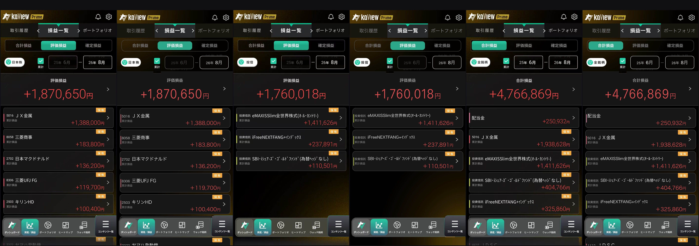

# kaView Prime 損益一覧 — 像素级 HTML 复刻

以三张 iOS App 截图为基准,用单文件 HTML/CSS 复刻 kaView Prime「損益一覧」页面,并通过多轮测量与目视审查逼近原图。



## 文件

| 文件 | 说明 |
|---|---|
| `kaview-prime.html` | 复刻成品(单文件,零外部依赖,资源全部内联为 base64) |
| `原图-日本株.jpg` / `原图-投信.jpg` / `原图-全銘柄.jpg` | 基准原图(三个分类状态) |
| `对比-原图vs复刻-定稿.png` | 六联对比图(原图/复刻交替,2x 尺度) |
| `对比-原图vs复刻.png` | 早期版本对比图(历史基线) |

## 用法

直接用浏览器打开 `kaview-prime.html`,或起一个本地静态服务:

```bash
python3 -m http.server 8123
```

页面为 388×791 的固定画布(对应 iPhone 逻辑分辨率)。

**交互**:点击左上角分类胶囊可在 日本株 / 投信 / 全銘柄 三态间切换;主标签与子标签可点击;所有数字、銘柄名、代码、日期均可直接点击编辑。

## 实现要点

- **同源抠图**:logo、铃铛、齿轮、主标签左右箭头、漏斗圆标、卡片/大数字箭头、保有徽章、累計勾选块、底部导航整条 — 共 10 类元素直接从原图抠出为透明 PNG 内联,与原图像素同源。
- **字体分层**:CJK 与卡片金额走 Hiragino Kaku Gothic ProN(与 iOS 同一字库);大数字、日期、破折号走 SF 系,其中大数字使用 `font-stretch: condensed` 匹配原 App 的窄体数字;全局 `-webkit-font-smoothing: antialiased` 对齐 CoreText 的灰阶抗锯齿。
- **几何标定**:字号由列投影 pitch 法在原生分辨率上实测反推(而非目测),布局锚点以 DOM 量测为准(卡列节距 72.5、卡内名称/标签/金额三锚点等)。
- **配色**:主题绿、卡片色条、徽章、边框等均在一手原图上原生取色。

## 已知边界

- 字体依赖系统内置的 Hiragino / SF,在非 Apple 平台会回落到 Noto Sans JP 等,字形存在可见差异。
- 底部导航为整块抠图,其点击切换 active 的装饰性交互不可用(分类切换与文本编辑不受影响)。
- 被底部导航遮挡的末尾卡片数据在原图中不可见,为推断补全。
- 基准原图经过压缩,残余色差与亚像素偏移无法进一步消除。
